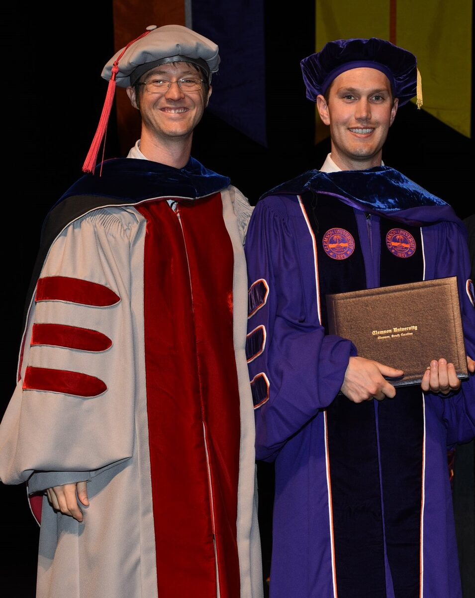
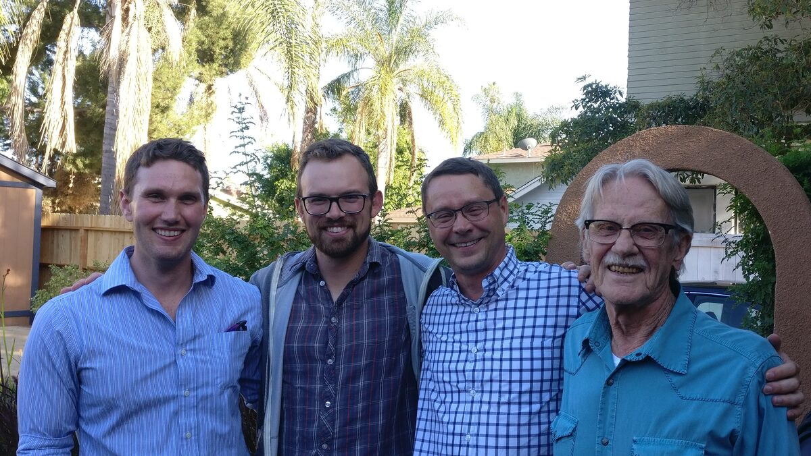
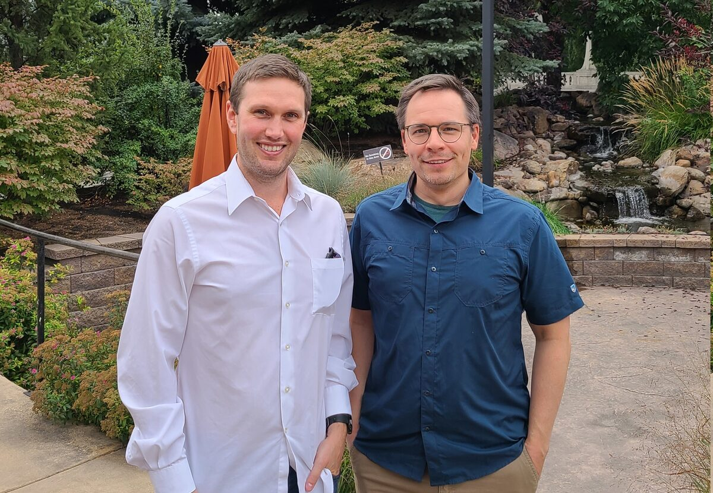

I am a Political-Geographical Economist. Here is a short version of how I came
to this, as well as some other miscellaneous details about me.

I was born in Edmonton, Alberta, Canada and moved to the state of Washington
for college when I was 18. I discovered economics while I was at Pacific
Lutheran University, and I have never looked back. Pursuing this career led me
to South Carolina, California, Utah, Germany, and now British Columbia, where
I am an Assistant Professor of Economics at Thompson Rivers University.

Below are some pictures of me over these years, alongside some colleagues,
mentors, and friends that I've been fortunate enough to meet along the way.

::: {layout-ncol=3}

:::

I have many academic inspirations, but Milton Friedman ([Greed](https://www.youtube.com/watch?v=RWsx1X8PV_A))
holds the proud title of being my favorite Youtube and sparking my initial
excursion into economics. My research as a whole is probably most inspired by
Thomas Schelling, evident in my specializations on conflict economics and
spatial modeling. I am also motivated by the classics in political economy,
which has led me to incorporate politics, geography, and war into my thinking,
and I quote these inspirations liberally:

> "Commerce and manufacturers gradually introduced order and good government.
> And with them, the liberty and security of individuals, among the
> inhabitants of the country, who had before lived almost in a continual state
> of war with their neighbours and of servile dependency upon their superiors.
> This, though it has been the least observed, is *by far the most important*
> of all their effects."
>
> Adam Smith, *The Wealth of Nations*

I am a methodological pluralist, meaning I try to learn from sources as varied
as narrative histories to laboratory experiments. I also have a general
fascination with spatial evolution and an almost religious adherence to
automating my workflow (hence my [github.com/Jadamso](https://github.com/Jadamso)
account and Linux OS). I've worked on, or am working on, several R packages.
The biggest three are

- **STrollR**: Space-Time standard errors for big-lattice data (Public)
- **AncientR**: Ancient geo-data on violence, politics, and geography (Private now, Public soon)
- **SetupGameR**: Laboratory experiments with R + Shiny (Private now, Public soon)

In addition to my main research questions, I am generally interested in
Archeology, Anthropology, Urbanization, Game Theory, Computing, Geographic
Information Systems, Spatial Statistics, Data Visualization, Epistemology, and
History of Thought.

<!--
Since graduate school, I've grown to enjoy writing. (Including a little poem
below, which I guess is a sign I've read too much McCloskey if I did not make
a haiku about the pigeon-hole principle as an undergraduate.) Over the last
several years, I've also enjoyed learning about Leipzig: previously a major
European city at the confluence of both the major European East–West and
North–South trade routes, and making a comeback from DDR times. Now I am
looking forward to exploring the Rocky Mountains with my family in Kamloops.
-->

<!--
### The Little Poem of the Applied Econometrician

> Have little faith in statistics sold,\
> for most that glitters is not gold.\
> Theory helps when it's done right,\
> but math alone has few insights.\
> External forces play their part,\
> but human choice is at heart.

ChatGPT version (which is better?):

> Place little trust in data's gleam,\
> For not all gold reflects its beam.\
> Theory shines when crafted well,\
> But numbers alone lack stories to tell.\
> External forces play their role,\
> Yet human choice lies at the soul.
-->
